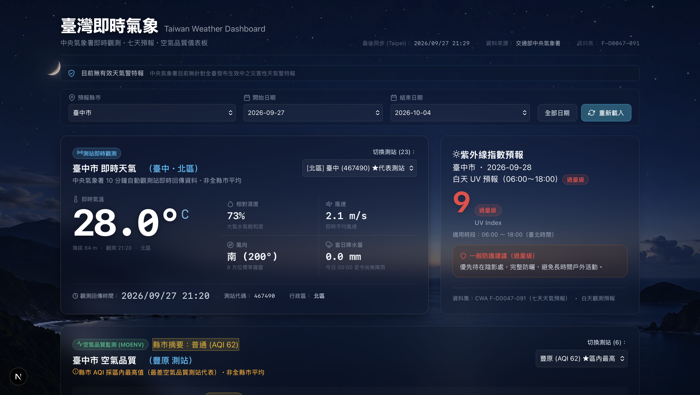
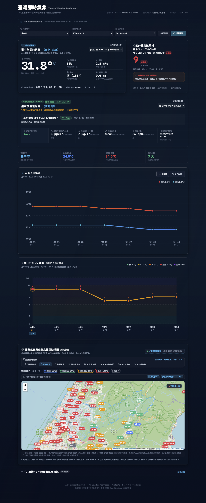
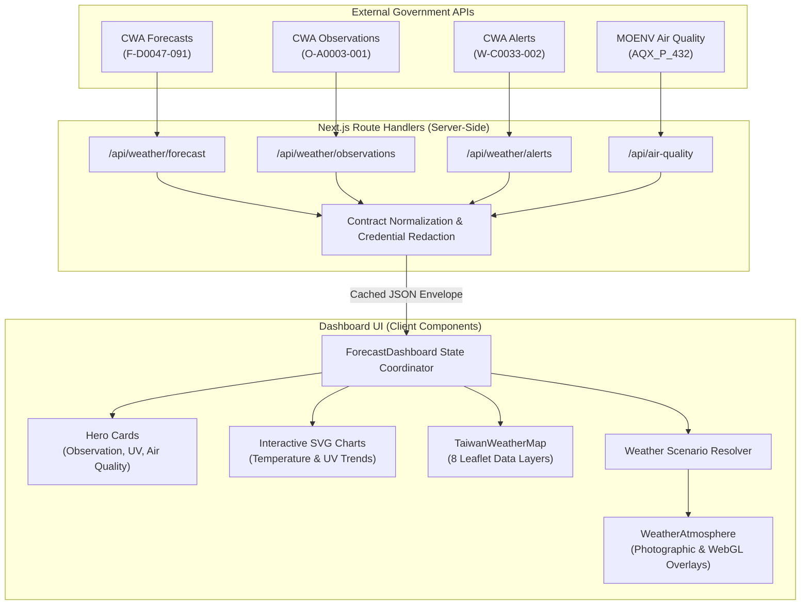
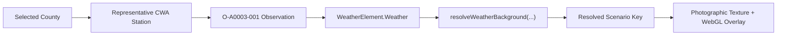

# Taiwan Weather Dashboard

[](https://nextjs.org/)
[](https://react.dev/)
[](https://www.typescriptlang.org/)
[](https://vitest.dev/)
[](https://opensource.org/licenses/MIT)

An interactive environmental dashboard visualizing real-time meteorological observations, 7-day regional forecasts, ultraviolet radiation levels, air quality metrics, and active weather alerts across all 22 administrative divisions of Taiwan. Built on a stateless serverless architecture, the dashboard integrates official open data from Taiwan's Central Weather Administration (CWA) and Ministry of Environment (MOENV) with custom WebGL optical atmosphere overlays and interactive geospatial layers.

- [Live Demo](https://weather-web-eight-khaki.vercel.app)
- [GitHub Repository](https://github.com/bambamboo0321/AIOT-HW1)

---

## Preview



<details>
<summary><strong>View full dashboard</strong></summary>

<br>



</details>

---

## Current Features

- **22 Administrative Divisions**: Comprehensive coverage of all 22 counties and cities in Taiwan, defaulting to **`臺中市`** on initial launch.
- **7-Day Regional Temperature Forecasts**: Forecast minimum and maximum temperatures, daytime/nighttime intervals, and daily summaries derived from CWA dataset `F-D0047-091`.
- **Real-Time Weather Observations**: Live meteorological readings from the nearest CWA synoptic observation station (`O-A0003-001`), including temperature, relative humidity, 10-minute/1-hour precipitation, daily accumulation, and wind speed and direction.
- **Station Selection & Representative Fallback**: Automatic selection of the county's primary representative station with support for manual switching among all available stations within the region.
- **Ultraviolet Index Forecasts**: Daily UV risk assessment, peak index values, risk category badges, and actionable sun protection recommendations.
- **Real-Time Air Quality Monitoring**: Air Quality Index (AQI) ratings and pollutant concentrations (PM2.5, PM10, O3, CO, SO2, NO2) sourced from MOENV dataset `AQX_P_432`.
- **Active Weather Hazard Alerts**: Prominent alert banners displaying active CWA severe weather warnings (`W-C0033-002`) impacting the selected county.
- **Interactive SVG Trend Charts**: Responsive vector visualizations for 7-day temperature curves and daytime UV index trajectories with hover inspections.
- **Raw Forecast Intervals**: Collapsible technical tables detailing raw 12-hour meteorological intervals.
- **Interactive Geospatial Map**: Leaflet-powered Taiwan weather map supporting 8 switchable data layers:
  1. Forecast Maximum Temperature (`forecast_max_temp`)
  2. Real-Time Temperature (`realtime_temp`)
  3. Relative Humidity (`relative_humidity`)
  4. Wind Speed and Direction (`wind`)
  5. Daily Cumulative Precipitation (`daily_precipitation`)
  6. Air Quality Index (`aqi`)
  7. PM2.5 Concentration (`pm25`)
  8. Ultraviolet Index (`uv`)
  Features include official county boundaries (GeoJSON), administrative seat markers, and fast station-to-dashboard synchronizations.
- **Responsive Architecture**: Fluid CSS Grid and Flexbox layouts optimized for mobile, tablet, and desktop viewports with full `prefers-reduced-motion` compliance.

---

## Data Sources

The dashboard retrieves authoritative public data directly from Taiwan government open data APIs. Responses are validated and normalized server-side into strictly typed contracts.

| Provider | Dataset ID | Endpoint / Type | Purpose | UI Applications |
|---|---|---|---|---|
| **CWA (中央氣象署)** | `F-D0047-091` | REST API (JSON) | 7-day county and city weather forecasts | Regional forecast temperatures, MinT/MaxT pairing, 12h intervals, daily aggregation, UV index (`UVI`) |
| **CWA (中央氣象署)** | `O-A0003-001` | REST API (JSON) | 10-minute synoptic automatic station observations | Real-time temperature, RH%, rainfall, wind speed/direction, and `WeatherElement.Weather` phenomenon |
| **CWA (中央氣象署)** | `W-C0033-002` | REST API (JSON) | Active weather alerts and hazard warnings | Regional alert banners (heavy rain, cold surges, strong winds, typhoons) |
| **MOENV (環境部)** | `AQX_P_432` | REST API (JSON) | Real-time air quality index (AQI) | Station AQI, PM2.5, PM10, gaseous pollutants, health advisories, map AQI layer |
| **Static Geographic** | `EPSG:4326` | Static JSON / TS | Administrative seats and boundary geometries | 22 county government seat coordinates and simplified Taiwan administrative boundary polygons |

*Note: Datasets such as `O-A0002` or satellite cloud-imaging analysis are not part of this runtime pipeline.*

---

## Current Architecture

The production web application runs as a stateless Next.js service on Vercel. Upstream API calls are encapsulated within server-only route handlers, ensuring private API keys are never exposed to browser bundles.



### Architectural Highlights

- **Stateless Serverless Execution**: Server route handlers act as lightweight normalization gateways. No relational database engine is required in the V2 runtime.
- **Credential Protection**: `CWA_API_KEY` and `MOENV_API_KEY` are validated on-demand via server-only modules (`web/lib/server/env.ts`). Upstream error logs redact all authentication tokens and sensitive query parameters.
- **HTTP Caching**: Standard HTTP caching headers (`Cache-Control: public, max-age=300, s-maxage=600, stale-while-revalidate=1800`) reduce upstream query loads while keeping meteorological data current.

---

## Dynamic Weather Atmosphere

The dashboard features an immersive visual atmosphere that mirrors the live meteorological state of the selected county.



### Supported Scenarios

| Scenario Key | Photographic Background Asset | Visual Atmosphere Treatment |
|---|---|---|
| `clear-day` | `/images/weather-bg.webp` | Full photographic sky + **`DashboardSunOverlay`** (WebGL2 sunlight) |
| `cloudy-day` | `/images/weather/cloudy-day.webp` | Overcast day sky with stationary contrast overlay |
| `rain-day` | `/images/weather/rain-day.webp` | Daytime rain imagery + **`DashboardRainOverlay`** (WebGL2 wet-glass) |
| `dawn` | `/images/weather/dawn.webp` | Morning twilight sky with subtle dawn gradient treatment |
| `sunset` | `/images/weather/sunset.webp` | Sunset amber sky with subtle horizon gradient treatment |
| `clear-night` | `/images/weather/clear-night.webp` | Deep night sky with stationary readability treatment |
| `cloudy-night` | `/images/weather/cloudy-night.webp` | Overcast nocturnal sky with stationary readability treatment |
| `rain-night` | `/images/weather/rain-night.webp` | Night rain imagery + **`DashboardRainOverlay`** (WebGL2 wet-glass) |
| `default` | `/images/weather-bg.webp` | Neutral baseline photographic background with contrast overlay |

### WebGL Visual Technology

- **DashboardSunOverlay (Sun Optics)**:
  - Custom GLSL WebGL2 shader pipeline (`sun-shaders.ts`, `optical-state.ts`).
  - Deterministic scroll-driven optical model: scroll position acts directly as the animation timeline playhead.
  - Generates solar core bloom, volumetric crepuscular rays, chromatic lens flares, and foreground optical spill onto UI cards without continuous JavaScript render loops.
- **DashboardRainOverlay (Wet-Glass Rain)**:
  - GPU-accelerated wet-glass refraction powered by `raindrop-fx` and `@sardinefish/zogra-renderer`.
  - Samples the active scenario's photographic background asset (`rain-day.webp` or `rain-night.webp`) directly within the fragment shader to produce optical lens distortion, sliding droplet trails, and glass condensation.
- **Graceful Degradation**:
  - Both WebGL overlays run with `pointer-events: none` at specified depth layers, preserving UI interactivity.
  - In environments without WebGL2 support, the system safely suppresses canvas effects while keeping the underlying photographic background and data cards fully legible.

---

## Weather Semantics

- **Present Weather Detection**: Current weather conditions are determined by CWA `O-A0003-001` field `WeatherElement.Weather` (`currentWeatherPhenomenon`).
- **Precipitation Semantics**: Cumulative daily rainfall (`dailyPrecipitation`) records total volume since midnight and is **not** treated as proof that it is currently raining. Current production rain scenarios (`rain-day` / `rain-night`) are determined strictly from `WeatherElement.Weather` when it indicates active precipitation phenomena such as `雨`, `陣雨`, or `雷雨`.
- **Missing Phenomenon Fallback**: If an observation station lacks automated present-weather instruments, the resolver defaults gracefully to a neutral time-based scene (`clear-day` or `clear-night`).
- **Dawn and Sunset Windows**:
  - `dawn`: **05:00–06:59** (Asia/Taipei local clock time).
  - `sunset`: **17:00–18:59** (Asia/Taipei local clock time).
  - *These represent fixed visual design intervals and are not calculated from astronomical ephemeris equations.*

---

## Tech Stack

| Category | Technology | Version | Purpose |
|---|---|---|---|
| **Core Framework** | [Next.js](https://nextjs.org/) | 16.3.6 | App Router, Server Components, Route Handlers (Turbopack) |
| **UI Library** | [React](https://react.dev/) | 19.2.8 | Declarative component hierarchy and client state |
| **Language** | [TypeScript](https://www.typescriptlang.org/) | 5.x | End-to-end static typing and strict interface contracts |
| **Geospatial Mapping** | [Leaflet](https://leafletjs.com/) & [react-leaflet](https://react-leaflet.js.org/) | 1.9.4 / 5.0.0 | Multi-layer interactive vector maps and GeoJSON rendering |
| **Visual Atmosphere** | WebGL2 & [raindrop-fx](https://github.com/SardineFish/raindrop-fx) | 1.0.8 | Custom GLSL optical sun shaders & wet-glass rain simulation |
| **Charting** | Custom Native SVG | — | Lightweight, dependency-free responsive trend charts |
| **Styling** | Vanilla CSS Tokens | — | Glassmorphism design system, CSS Grid, accessibility tokens |
| **Testing** | [Vitest](https://vitest.dev/) & [Testing Library](https://testing-library.com/) | 3.0.0 / 16.3.3 | Unit and integration testing with `jsdom` |
| **Deployment** | [Vercel](https://vercel.com/) | — | Stateless serverless edge hosting |

---

## Project Evolution

This repository started as a graduate data engineering assignment and systematically evolved into a modern, stateless web application.

### Phase 1 — Streamlit V1 / Data Pipeline Foundation (M0–M7)
- **M0**: Initialized Python repository and established automated GitHub-to-Streamlit deployment (`3910674`).
- **M1**: Implemented HTTP GET client for CWA forecast dataset `F-D0047-091` (`d67f456`).
- **M2**: Parsed nested CWA JSON into structured Pandas DataFrames with UTC+8 timestamps (`95d689f`).
- **M3**: Designed local SQLite persistence with unique composite constraints to store immutable forecast snapshots (`a9c343d`).
- **M4**: Developed a snapshot-isolated SQL query layer to query forecasts by region and timestamp (`d614359`).
- **M5**: Built an interactive Streamlit dashboard featuring temperature KPIs, charts, and data tables (`369c284`).
- **M6**: Integrated a Folium interactive Taiwan county map with temperature-coded markers (`091ede2`).
- **M7**: Documented Streamlit Cloud deployment, Python 3.11 runtime validation, and certifi SSL compatibility (`7547b6a`).

### Phase 2 — Next.js V2 Architecture (M7+ to M12)
- Replaced the ephemeral Python/SQLite runtime with a stateless, production-grade Next.js web application under `web/` (`3ab515e`).
- Built server-side CWA clients with schema normalization, reducing ~685 KB raw payloads to ~15 KB typed responses (`84da758`).
- Developed a high-performance Leaflet county map and real-time CWA station observation integration (`2359aaa`, `0c5f914`).
- Integrated MOENV real-time air quality metrics (`AQX_P_432`) and automated station proximity matching (`6266d42`).
- Added regional weather alerts (`W-C0033-002`) and daytime ultraviolet index trends (`6a3c51e`).
- Upgraded the Leaflet map to support 8 switchable meteorological and environmental layers (`80032c8`).

### Phase 3 — M13 Dynamic Visual Atmosphere
- Redesigned UI with glassmorphism styling and photographic weather scenes (`92b18dc`).
- Researched and integrated WebGL wet-glass rain effects using `raindrop-fx` (`7f5289a`).
- Designed a custom WebGL2 solar optical shader model featuring scroll-driven crepuscular rays and card glare (`6f57ba3`, `96129c8`).

### Phase 4 — M14 Production Integration
- Refined dashboard information hierarchy and visual contrast (`fa3bc8e`).
- Connected live `WeatherElement.Weather` observations directly to the atmosphere resolver, eliminating preview query flags.
- Cleaned up obsolete legacy CSS particle and flare systems.
- Updated the default forecast county to **`臺中市`** (`5ffca98`).

---

## Getting Started — Current V2 Application

### Prerequisites

- **Node.js**: `v20.0.0+`
- **npm**: `v10.0.0+`
- **CWA API Key**: Obtainable from [CWA Open Data Platform](https://opendata.cwa.gov.tw/)
- **MOENV API Key**: Obtainable from [MOENV Open Data Platform](https://data.moenv.gov.tw/)

### 1. Clone Repository & Install Dependencies

```bash
git clone https://github.com/bambamboo0321/AIOT-HW1.git
cd AIOT-HW1/web
npm install
```

### 2. Configure Environment Variables

Create a `.env.local` file inside the `web/` directory:

```bash
cp .env.example .env.local
```

Populate the required server keys:

```ini
# Central Weather Administration Open Data API Key
CWA_API_KEY=your_cwa_api_key_here

# Ministry of Environment Open Data API Key
MOENV_API_KEY=your_moenv_api_key_here

# Optional: Administrative utility password
ADMIN_PASSWORD=your_optional_admin_password
```

*(Note: Never commit `.env.local` to version control. It is ignored by `.gitignore`.)*

### 3. Run Development Server

```bash
npm run dev
```

Open [http://localhost:3000](http://localhost:3000) in your browser to view the application.

---

## Quality & Testing

The `web/` test suite contains **34 test files** executed using Vitest and Testing Library.

```bash
# Run all unit and integration tests
npm run test:run

# Run TypeScript compilation checks
npm run typecheck

# Run ESLint validation
npm run lint

# Verify production bundle build
npm run build
```

### Test Coverage Highlights

- **Server Clients & Error Boundaries**: Upstream request timeouts, error categorization, and secret redaction.
- **Data Normalization & Contracts**: Validating JSON contracts for CWA forecasts, observations, alerts, and MOENV AQI payloads.
- **Data Transformations**: Temperature pairing, Taipei time conversions, UV risk indexing, and precipitation semantics.
- **Geospatial Map & Semantic Zoom**: Multi-layer state coordination, marker rendering, and GeoJSON boundary topology.
- **Atmosphere & Visual Integration**: Weather scenario resolution, WebGL overlay mount conditions, and `prefers-reduced-motion` fallbacks.

---

## Legacy Streamlit V1 Application

The original educational Python application remains functional in the repository root for evaluation and historical reference.

```
[ CWA REST API ] ──> [ requests ] ──> [ Pandas ] ──> [ SQLite Snapshot ] ──> [ Streamlit / Folium ]
```

- **Runtime & Dependencies**: Python 3.11, `streamlit`, `pandas`, `requests`, `folium`, `sqlite3`.
- **Key Concepts**:
  - **Immutable Snapshots**: Forecast fetches stored as immutable rows keyed by `fetched_at`.
  - **Snapshot Isolation**: SQL queries strictly isolated to the latest snapshot to prevent cross-fetch contamination.
  - **Ephemeral Cloud Storage Notice**: On Streamlit Community Cloud, local SQLite database files are ephemeral and reset upon container restarts.
  - **Runtime Compatibility**: Verified on Python 3.11 with `certifi>=2025.1.31`.
- **Historical Deployment**: [Legacy V1 Demo](https://aiot-hw1-bambamboo.streamlit.app/)

### Running Legacy V1 Locally

```bash
# From repository root
python -m venv .venv
source .venv/bin/activate
pip install -r requirements-dev.txt

# Configure secrets
cp .streamlit/secrets.toml.example .streamlit/secrets.toml
# Edit .streamlit/secrets.toml with your CWA_API_KEY

streamlit run app.py
pytest tests/ -v
```

---

## Geographic Data & Attribution

The dashboard's geospatial visualizations rely on standardized Taiwanese geographic coordinate datasets:

- **Administrative Seat Representation**: Marker coordinates represent the primary administrative headquarters (City Hall or County Government) of each division in WGS84 (`EPSG:4326`). These coordinates serve as user-interface anchors rather than exact meteorological station positions.
- **County Administrative Boundaries**:
  - Source: Ministry of the Interior (MOI) Open Data — "直轄市、縣(市)界線(TWD97經緯度)" (Data ID: 7442).
  - Original Coordinate Reference System (CRS): `EPSG:3824` (TWD97 / GRS 1980).
  - Web Display CRS: Converted to `EPSG:4326` (WGS84 `[longitude, latitude]`) using PROJ/pyproj and Mapshaper with topology-preserving polygon simplification.
  - Remote Island Handling: To optimize map boundary fitting (`fitBounds`), certain distant uninhabited islets (such as the Pratas and Spratly Islands) are omitted from the visualization boundary, while all 22 standard county territories remain intact.
- **Licensing**: Government Open Data License, version 1.0 (OGL-Taiwan v1.0).
- **Disclaimer**: Administrative boundaries and coordinates are provided solely for visual reference and UI navigation. They are not intended for cadastral surveying, legal boundaries, or navigation purposes.

---

## Known Limitations

- **Fixed Dawn/Sunset Time Windows**: Morning twilight (05:00–06:59) and sunset (17:00–18:59) are configured as fixed Asia/Taipei clock intervals rather than dynamic astronomical solar ephemeris calculations.
- **Weather Phenomenon Coverage**: Certain automatic CWA weather stations without present-weather sensors do not provide `WeatherElement.Weather`. In these instances, the atmosphere engine defaults to a neutral time-based background.
- **WebGL2 Support Requirement**: Advanced wet-glass refraction and optical sunlight effects require WebGL2. If unavailable, the application gracefully renders photographic backdrops and data cards.
- **Stateless History**: The V2 architecture does not maintain a long-term historical database of observations; it operates purely as an on-demand real-time visualization layer.
- **Map Marker Offsets**: Map markers correspond to county administrative seats to ensure visibility in major population centers, whereas weather observation cards display data from the nearest CWA observation station.

---

## License

This project is licensed under the MIT License.
All government meteorological and environmental data remain the intellectual property of their respective publishing agencies under OGL-Taiwan v1.0.
