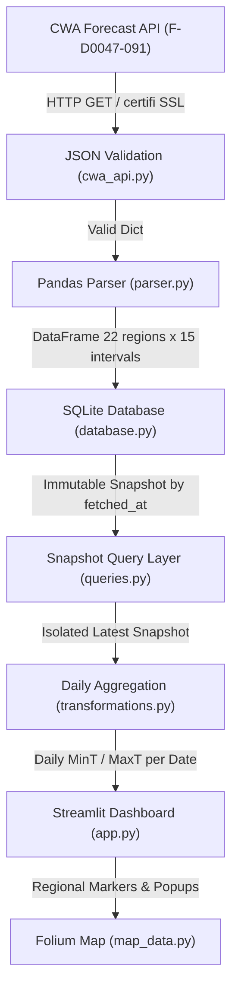
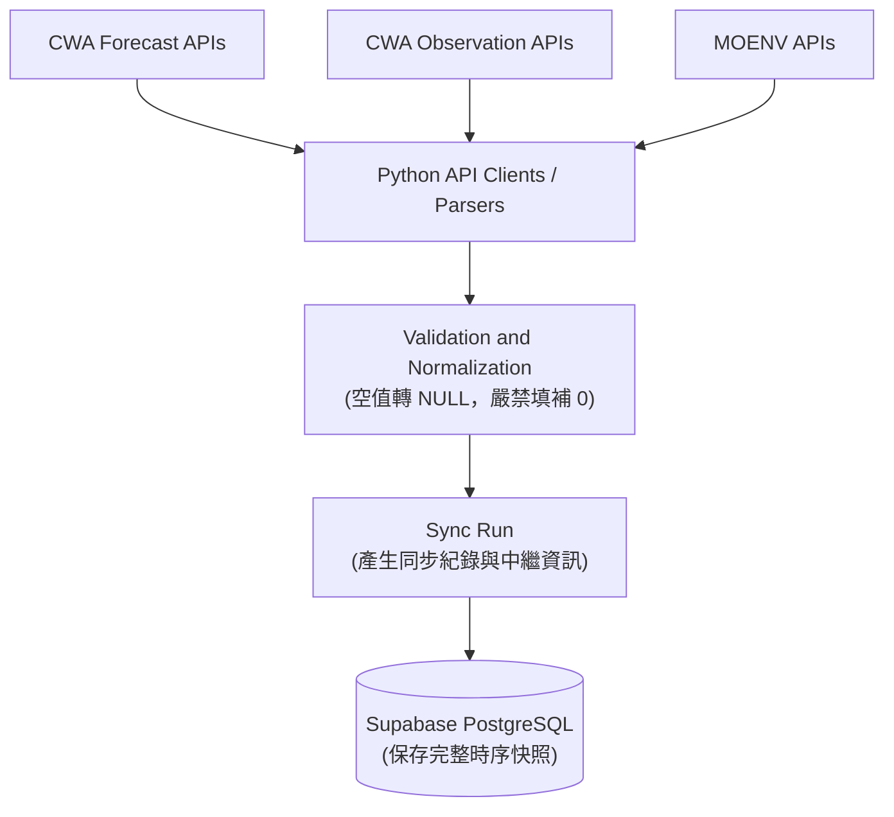
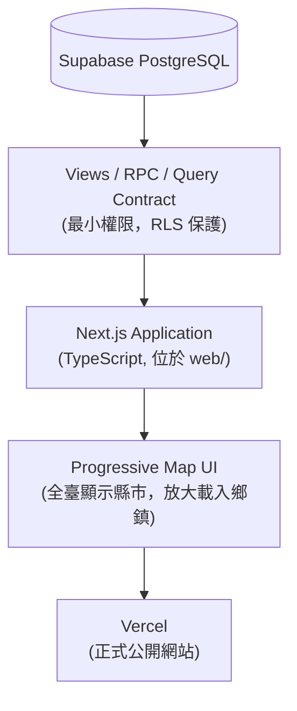
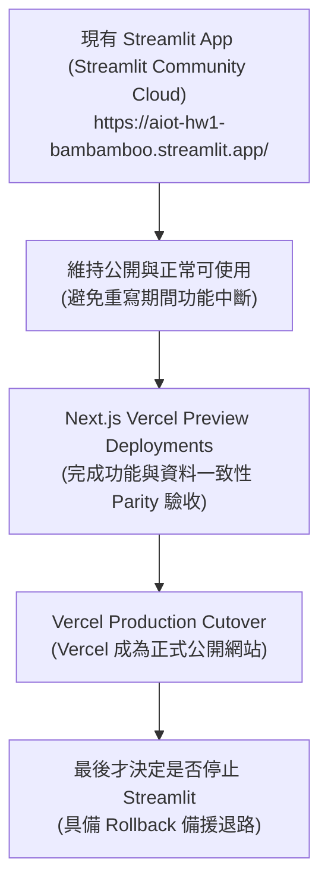
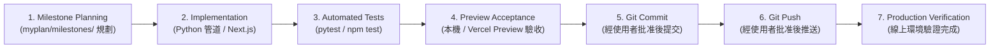

# 系統資料流與開發工作流程 (FLOW.md)

本文件使用 Mermaid 架構圖與詳細文字說明系統資料流（現行 M1～M6 架構、V2 目標架構、平行動態遷移策略），以及專案交付標準作業流程。

---

## 1. 現行資料流架構 (M1～M6)

現行系統為單一資料源、單向資料管道設計，針對中央氣象署 (CWA) 一週縣市預報進行取得、清理、快照儲存與展示。

---

## 2. V2 目標資料流架構 (V2 Target)

V2 架構嚴格將「**後端資料同步管道**」與「**前端公開網站**」分離（決策 D-016、D-017、D-026），公開使用者絕不直接呼叫政府 API。

### 管道一：資料同步管道 (Data Synchronization Pipeline)

由受密碼保護之 Python 同步管理程序（M15）或後續排程（M17）觸發，保留已測試之 Python API client 與 parser，完整同步政府開放資料至 Supabase PostgreSQL。

*   **外部資料源**：包含 CWA 縣市與鄉鎮預報 (M8/M9)、地面即時氣象觀測 (M10)、MOENV 空氣品質 AQI (M11)、CWA 紫外線候選與警特報 (M12)。
*   **例外與失敗保護 (決策 D-006, D-022)**：同步失敗時保留並顯示最近一次成功資料及時間，禁止產生假成功快照，且**絕不默默切換寫入容器本機 SQLite**。

### 管道二：公開網站管道 (Public Web Application Pipeline)

公開訪客（桌面、平板、手機）透過 Next.js 應用程式讀取 Supabase PostgreSQL，部署於 Vercel，提供高效、無障礙與漸進式多圖層地圖體驗。

*   **最小授權與瀏覽器安全 (決策 D-029)**：瀏覽器端僅持有 `NEXT_PUBLIC_SUPABASE_URL` 與 `NEXT_PUBLIC_SUPABASE_ANON_KEY`，所有讀取必須受 Row Level Security (RLS) 保護；`SUPABASE_SERVICE_ROLE_KEY`、`DATABASE_URL` 與 API Keys 絕不傳入瀏覽器。
*   **按需載入 (決策 D-020, D-024)**：完整時序存在 DB，前端僅查詢目前 Viewport、Zoom 與選定圖層所需之最小數據集。
*   **漸進式揭露 (決策 D-018)**：全臺視角展示 22 縣市摘要，放大或選取縣市後才載入鄉鎮與測站。
*   **全裝置核心操作 (決策 D-019)**：Hover 僅為桌面輔助提示；Click、Tap 與鍵盤操作叫出常駐詳細面板，保證行動裝置 100% 完整可用。

---

## 3. 平行遷移策略 (Parallel Migration Strategy)

專案採用安全漸進的雙軌平行動態遷移（決策 D-027, D-031, D-032），**絕非直接把現有 Streamlit app.py 搬到 Vercel 部署**，亦不提早關閉現有可用服務。

---

## 4. 開發與交付工作流程 (Development Workflow)

每個 Milestone 的實作與交付均遵循標準的生命週期：

### 各步驟執行細則：
*   **Step 1: Milestone Planning**：確認需求邊界、更新 `ROADMAP.md` 為 `In Progress`，備妥設計文件與驗收標準。
*   **Step 2: Implementation**：撰寫或修改模組（M7～M12 為 Python 資料層，M13～M14 為 PostgreSQL views/contracts 與 `web/` Next.js 前端）。
*   **Step 3: Automated Tests**：使用假資料與 Fixture 執行測試（Python 使用 `pytest`，前端使用 `npm test` / typecheck / lint），確保既有測試與新測項全數通過。
*   **Step 4: Preview Acceptance**：於本機或 Vercel Preview 環境執行各情境操作，驗證 UI 反應、邊界條件與例外處理。
*   **Step 5: Git Commit**：停下取得使用者明確批准後，遵循 Conventional Commits 規範提交。
*   **Step 6: Git Push**：經使用者授權後推播至遠端觸發 CI/CD。
*   **Step 7: Production Verification**：確認線上網址運作正常、Secrets 注入無誤、記錄最終驗收成果並標記 Milestone 為 `Completed`。
