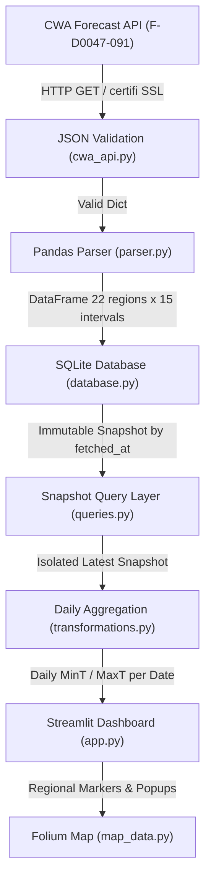
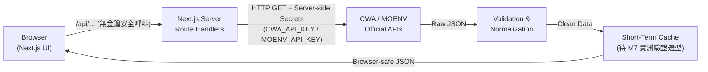
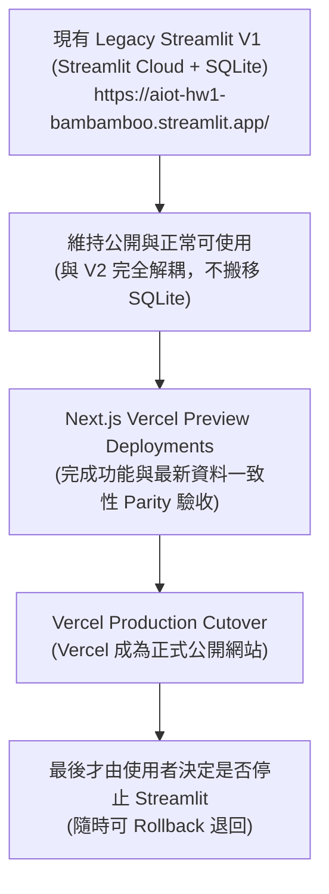
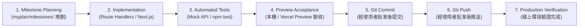

# 系統資料流與開發工作流程 (FLOW.md)

本文件使用 Mermaid 架構圖與詳細文字說明系統資料流（Legacy Streamlit V1 架構、Stateless Vercel V2 目標架構、平行動態遷移策略），以及專案交付標準作業流程。

---

## 1. 現行資料流架構 (Legacy Streamlit V1 / M1～M6)

現行 Legacy V1 系統為單一資料源、單向資料管道設計，針對中央氣象署 (CWA) 一週縣市預報進行取得、清理、SQLite 快照儲存與展示。此架構保留作為目前公開運作之 baseline，與 V2 隔離。

---

## 2. Stateless Vercel V2 目標資料流架構 (V2 Target)

V2 架構全面轉型為**無永久資料庫 (Stateless)** 之現代化 Web 應用程式（決策 D-026, D-033, D-034）。
系統不建立 PostgreSQL、Supabase、Neon 或任何持久化資料庫，亦不保存長期歷史時序快照，僅聚焦於呈現「最新即時觀測、目前 AQI、最新 UV、有效警特報與官方未來預報」。

### 核心資料流向 (Request-Response Flow)：

### 核心運作規則：
1.  **金鑰安全隔離（決策 D-034）**：
    *   瀏覽器**絕對無法**取得 `CWA_API_KEY` 或 `MOENV_API_KEY`。
    *   瀏覽器**嚴禁**直接呼叫需要金鑰的政府 API。
    *   API Key 嚴格僅能存放於 Vercel Server-side Environment Variables。
2.  **Next.js Server 代理轉發（決策 D-034, D-039）**：
    *   由 M7 建立最小 `web/` 專案基礎，Next.js Server Route Handlers (`/api/...`) 作為安全網關 (API Gateway)，負責代理官方 API 請求；M14 在此基礎上建立完整地圖 UI。
3.  **無永久資料庫 (Stateless，決策 D-033)**：
    *   V2 不建立 PostgreSQL、Supabase、Neon 或其他任何永久雲端資料庫。
    *   不保存歷史快照，不執行複雜資料庫 Migration。
4.  **僅呈現最新與預報資料**：
    *   最新地面即時氣象觀測（溫度、濕度、風向、風速、陣風、雨量）。
    *   目前空氣品質 AQI 及主要污染物。
    *   目前或官方定義之紫外線數值。
    *   當前有效之氣象災害警特報。
    *   官方發布之未來逐時與逐日預報。
5.  **短期快取原則（決策 D-035, D-040, D-041）**：
    *   **快取不是資料庫**：不得依賴快取作為資料可用性的唯一保證。
    *   **不依賴 Function process 記憶體**：Vercel Function instance memory 不保證跨 request、instance 或 deployment 保留。
    *   **快取實作機制待 M7 實測定案**：M7 Research 必須確認目前 Next.js / Vercel 正式支援的 cache API（候選包括 Next.js supported fetch/data cache、Vercel CDN caching headers 或其他官方 primitive，不預先 Accepted），不得在規劃文件中假裝已完成選型。
    *   **Cache Miss 行為**：Cache Miss 時向官方 API 重新取得最新資料。
    *   **TTL 為 Initial Candidate TTL**：預報 10～30 分鐘、觀測與空品 5～15 分鐘、警特報 2～5 分鐘皆為 Initial Candidate TTL，最終 TTL 由各 Milestone 依官方更新頻率、API response headers、發布時間、使用限制、使用者 freshness 需求與 outage 行為決定。
6.  **外部失敗與 Freshness 狀態行為（決策 D-022, D-038, D-040）**：
    *   所有 API response 必須包含 source timestamp / fetched timestamp / freshness status（`fresh` / `stale` / `unavailable`）等欄位，前端 UI 必須清楚顯示資料時間。
    *   `fresh`：資料於有效 TTL 內且與最新官方更新一致。
    *   `stale`：上游 API 暫時連線失敗，但選定快取機制確實支援 stale retention 且仍有「實際可讀取」之合法 entry 時，才提供 stale response 並清楚標註原始時間戳；不得承諾 expired entry 一定仍可讀取。
    *   `unavailable`：上游 API 失敗且沒有「實際可讀取」的快取 entry 時，直接安全回傳 unavailable 與錯誤提示，**嚴禁偽造假成功資料、假時間戳，或將缺值補 0**。

---

## 3. 平行遷移策略 (Parallel Migration Strategy)

專案採用安全漸進的雙軌平行動態遷移（決策 D-027, D-031, D-032, D-037），現有 Streamlit 與 V2 前後端完全分離：

*   **舊版隔離**：現有 Streamlit + SQLite 為 Legacy V1，保留在現有網址運行，V2 不讀取、不搬移 `data/weather.db`。
*   **非 app.py 搬遷（決策 D-031）**：Vercel 僅部署位於 `web/` 的 Next.js 應用（由 M7 建立最小專案骨架與 Server Gateway，M14 建立完整地圖 UI），絕非將 Python Streamlit 搬到 Vercel。
*   **上線驗收門檻（決策 D-032）**：只有在 M16 完成 Vercel 預覽、最新資料一致性、手機觸控、效能與無障礙驗收後，才由使用者決定是否關閉 Streamlit。

---

## 4. 開發與交付工作流程 (Development Workflow)

每個 Milestone 的實作與交付均遵循標準的生命週期：

### 各步驟執行細則：
*   **Step 1: Milestone Planning**：確認需求邊界、更新 `ROADMAP.md` 為 `In Progress`，備妥無狀態 API Gateway 設計與驗收標準。
*   **Step 2: Implementation**：M7 建立最小 `web/` 專案骨架與 Server Gateway，M8～M12 擴充領域端點，M13 彙整統一合約，M14 建立完整地圖 UI。
*   **Step 3: Automated Tests**：使用 Mock API Fixture 測試逾時處理、TLS 連線、空值轉 NULL 與錯誤回應脫敏，執行 `npm test` / typecheck / lint。
*   **Step 4: Preview Acceptance**：於 Vercel Preview 環境檢視最新觀測、預報、空品與圖層互動，確認無任何金鑰洩漏至 Client。
*   **Step 5: Git Commit**：停下取得使用者明確批准後提交。
*   **Step 6: Git Push**：經使用者授權後推播至遠端觸發 CI/CD。
*   **Step 7: Production Verification**：確認線上網址運作正常、短期快取生效、記錄最終驗收成果並標記 Milestone 為 `Completed`。
