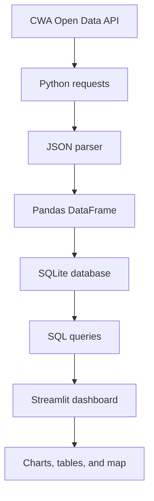
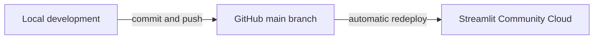

# Taiwan Weather Forecast — Project Workflow

## Project Summary

This project builds an interactive **Taiwan Weather Forecast Dashboard** using
open data from Taiwan's Central Weather Administration (CWA).

The application retrieves weather forecast data through the CWA REST API,
parses the returned JSON, transforms it into structured tabular data, stores it
in SQLite, and presents regional temperature forecasts through a Streamlit web
application. Users will be able to select a region and date, inspect minimum and
maximum temperatures, view trend charts and tables, and explore forecasts on a
Taiwan map.

The project is also intended as a hands-on introduction to a complete data
application workflow:

> API acquisition → JSON parsing → data cleaning → database storage → SQL
> queries → visualization → web deployment

Although the original course poster is titled "AI Innovation," the initial
version is primarily a **data engineering and web application project**. Machine
learning should be treated as an optional extension after the core pipeline is
working reliably.

## Target Architecture



## Development and Deployment Flow

GitHub is the source of truth. Streamlit Community Cloud reads the application
directly from this repository.



The deployment connection should be established as soon as the minimum
Streamlit app works. Every later milestone is then delivered with the same
cycle:

1. Create a small, testable change locally.
2. Run and verify it locally.
3. Commit the completed milestone.
4. Push to the `main` branch on GitHub.
5. Confirm that Streamlit redeploys successfully.

## Proposed Repository Structure

```text
AIOT-HW1/
├── app.py
├── workflow.md
├── README.md
├── requirements.txt
├── .gitignore
├── .streamlit/
│   └── secrets.toml.example
├── data/
│   └── .gitkeep
├── src/
│   ├── __init__.py
│   ├── cwa_api.py
│   ├── parser.py
│   ├── database.py
│   └── queries.py
└── tests/
    ├── test_parser.py
    └── test_database.py
```

### Module Responsibilities

| File | Responsibility |
|---|---|
| `app.py` | Streamlit user interface and page composition |
| `src/cwa_api.py` | Send requests to the CWA API and handle HTTP errors |
| `src/parser.py` | Convert nested CWA JSON into clean records/DataFrames |
| `src/database.py` | Create the SQLite schema and insert/update data |
| `src/queries.py` | Read filtered data for the dashboard |
| `tests/` | Verify parsing and database behavior independently of the UI |

## Milestone Workflow

### M0 — Repository and Minimum Deployment

**Goal:** Establish the GitHub-to-Streamlit delivery pipeline before adding
weather features.

Tasks:

- Add a minimal `app.py` that displays a title.
- Add all required Python packages to `requirements.txt`.
- Add `.gitignore` rules for secrets, local databases, caches, and virtual
  environments.
- Connect this repository to Streamlit Community Cloud using `main` and
  `app.py`.

Acceptance criteria:

- The repository can be cloned and installed without missing dependencies.
- The Streamlit URL loads successfully.
- A push to `main` causes the deployed app to update.

### M1 — CWA API Acquisition

**Goal:** Retrieve one selected CWA forecast dataset successfully.

Tasks:

- Register for a CWA Open Data authorization key.
- Select and document the exact dataset ID.
- Read the API key from an environment variable or Streamlit secret.
- Send an HTTP GET request with a timeout.
- Check the response status before parsing JSON.
- Display useful error messages without exposing the API key.

Acceptance criteria:

- A local command can retrieve valid JSON from the selected endpoint.
- Invalid credentials, timeouts, and non-200 responses are handled clearly.
- No credential appears in Git history or application logs.

### M2 — JSON Parsing and Data Cleaning

**Goal:** Transform the nested response into a predictable DataFrame.

Target columns:

| Column | Meaning |
|---|---|
| `region` | Forecast region/city |
| `forecast_start` | Beginning of the forecast period |
| `forecast_end` | End of the forecast period |
| `min_temp` | Minimum forecast temperature in °C |
| `max_temp` | Maximum forecast temperature in °C |
| `fetched_at` | Time at which this response was acquired |

Tasks:

- Inspect and document the actual JSON path used by the selected dataset.
- Extract region, time, `MinT`, and `MaxT` values.
- Convert temperature fields to numeric types and timestamps to a consistent
  format.
- Validate required fields and handle missing values explicitly.
- Add parser tests using a saved, sanitized JSON fixture.

Acceptance criteria:

- The same input always produces the same column schema.
- Temperatures are numeric rather than strings.
- A malformed or incomplete record does not crash the entire import.

### M3 — SQLite Storage

**Goal:** Persist forecast snapshots so the dashboard does not depend on a new
API request for every interaction.

Recommended initial schema:

```sql
CREATE TABLE IF NOT EXISTS weather_forecasts (
    id INTEGER PRIMARY KEY AUTOINCREMENT,
    region TEXT NOT NULL,
    forecast_start TEXT NOT NULL,
    forecast_end TEXT NOT NULL,
    min_temp REAL,
    max_temp REAL,
    fetched_at TEXT NOT NULL,
    UNIQUE(region, forecast_start, forecast_end, fetched_at)
);
```

Tasks:

- Create the database and table automatically when absent.
- Insert cleaned records with parameterized SQL.
- Define a duplicate-data policy before scheduling repeated fetches.
- Keep local `*.db` files out of Git.

Acceptance criteria:

- Parsed records can be inserted and read back correctly.
- SQL values are passed as parameters, not interpolated into query strings.
- Re-running an import follows the documented duplicate policy.

> Note: a local SQLite database on Streamlit Community Cloud is not durable
> application storage and may be reset during redeployment. SQLite is suitable
> for learning and local development; persistent production history will later
> require an external database or a reproducible data-loading strategy.

### M4 — SQL Query Layer

**Goal:** Provide reusable functions for the UI to request only the data it
needs.

Tasks:

- Query distinct regions for the selector.
- Query forecasts by region and optional date range.
- Return results in chronological order.
- Keep SQL outside Streamlit widget code.

Acceptance criteria:

- A region query returns only matching rows.
- Results are sorted chronologically.
- Empty results are represented cleanly rather than treated as an exception.

### M5 — Streamlit Dashboard

**Goal:** Deliver a useful first version of the web application.

Tasks:

- Add a region select box and date/date-range control.
- Show current minimum and maximum forecast values.
- Draw a two-series temperature chart (`MinT` and `MaxT`).
- Display the underlying forecast table.
- Show loading, empty-data, and error states.

Acceptance criteria:

- Changing a selection updates every related component consistently.
- The chart and table use the same filtered records.
- The application remains usable on both desktop and mobile widths.

### M6 — Taiwan Map and Interface Integration

**Goal:** Add geographic exploration and complete the dashboard experience.

Tasks:

- Define or source coordinates for supported regions.
- Add a Folium map to Streamlit.
- Color markers using documented temperature ranges.
- Show region, forecast time, minimum, and maximum temperature in marker
  details.
- Integrate the map, chart, and table without duplicating query logic.

Acceptance criteria:

- Selecting a date updates the markers and their values.
- Every database region either has a known coordinate or is handled gracefully.
- The marker legend matches the implemented color thresholds.

### M7 — Quality, Documentation, and Final Review

**Goal:** Make the project reproducible and presentation-ready.

Tasks:

- Refactor repeated logic into focused functions.
- Add type hints, docstrings, and concise comments where they add clarity.
- Add tests for the parser, database, and important query behavior.
- Update `README.md` with setup, local run, secrets, deployment, and usage
  instructions.
- Record the live Streamlit URL and screenshots.
- Review dependencies and remove unused packages.

Acceptance criteria:

- A new contributor can run the project by following only the README.
- Tests pass before pushing the final version.
- No secrets, database files, caches, or local environment files are tracked.

## Secrets and Security

Never write the CWA authorization key directly in Python or commit it to
GitHub.

For local development, use `.streamlit/secrets.toml`:

```toml
CWA_API_KEY = "replace-with-your-key"
```

For Streamlit Community Cloud, add the same value in the app's **Secrets**
settings. Commit only an example file with a placeholder.

Minimum `.gitignore` entries:

```gitignore
.env
.venv/
venv/
.streamlit/secrets.toml
__pycache__/
*.py[cod]
*.db
.DS_Store
```

If a real key is accidentally committed, removing it from the latest file is
not sufficient. Revoke/rotate the key and then clean the repository history if
necessary.

## Suggested Commit Plan

Keep commits small enough that each one represents a working state.

| Milestone | Suggested commit message |
|---|---|
| M0 | `chore: initialize streamlit project` |
| M1 | `feat: fetch forecast data from CWA API` |
| M2 | `feat: parse CWA forecast JSON` |
| M3 | `feat: persist forecasts in SQLite` |
| M4 | `feat: add forecast query layer` |
| M5 | `feat: build forecast dashboard` |
| M6 | `feat: add interactive Taiwan weather map` |
| M7 | `docs: complete setup and deployment guide` |

## Optional Extensions

Implement these only after M0–M7 are stable:

- Scheduled data collection for historical forecast snapshots.
- Weather reminder notifications or a LINE Bot.
- Agricultural, travel, or disaster-prevention views.
- Additional CWA datasets such as rainfall or alerts.
- Comparison between previous forecasts and observed weather.
- A CRISP-DM machine-learning experiment using sufficient historical data.

Any AI/ML extension must define a real prediction question, baseline, training
data, evaluation metric, and leakage-safe test strategy. Adding a model solely
to label the project as AI is not a project requirement.

## Definition of Done

The core project is complete when:

- CWA forecast data is acquired without exposing credentials.
- JSON is transformed into a validated tabular schema.
- Forecast records can be stored and queried through SQLite.
- The Streamlit app supports region/date interaction.
- Forecasts are shown as a chart, table, and Taiwan map.
- The GitHub `main` branch automatically deploys a working application.
- Setup, architecture, limitations, and deployment are documented.
